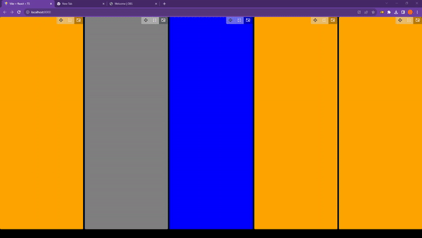

# React Smart-Layout

React Smart-Layout is a cutting-edge React library designed to effortlessly generate adaptive layouts that fit perfectly into any container. Empower your users by allowing them to swiftly reorganize elements and resize them to their needs.

<div style="width:100%; display:flex; align-items:align-center; gap:10px">
  
  
  
  
</div>

## 🌟 Features:

- **State Preservation**: Maintains the state of components even after repositioning, ensuring a consistent user experience.
- **Persistent Layout**: The layout remains intact even after page reload, offering users a reliable design continuity.
- **Adaptive**: Automatically adjusts content to fit any container size.
- **Animated**: Amazing animations for any element on the layout.
- **Movable**: Easy-to-use interface that lets users reposition elements in real-time.
- **Resizable Components**: Dynamically adjust the size of your components with intuitive resizing handles.
- **Highly Performant**: Optimized for peak performance to ensure smooth user interactions, even with a large number of components (don't be afraid to test it with grids and entire pages).
- **Seamless Integration**: Designed from the ground up to be easily integrated into any React project, no matter the size or complexity.

Give your users the ultimate layout experience and elevate your UI with React Smart-Layout! 🌐

## Example:

It's really easy to use, you just need to import the `ComponentLayout`
and add your children

```typescript
import { ComponentLayout } from "smart-layout";

<ComponentLayout id="starting-layout">
  <div style={{ width: "100%", height: "100%", background: "gray" }} />
  <div style={{ width: "100%", height: "100%", background: "blue" }} />
  <div style={{ width: "100%", height: "100%", background: "orange" }} />
  <div style={{ width: "100%", height: "100%", background: "orange" }} />
  <div style={{ width: "100%", height: "100%", background: "orange" }} />
</ComponentLayout>;
```

### Result:



# 🚀 **Experience Smart-layout in Real-time!** 🚀

Dive into the interactive world of `Smart-layout` without any setup hassles! We've set up a live demo for you on StackBlitz. It's the perfect platform to experiment, tweak, and see our library in action.

Whether you're curious about its capabilities or just want to play around, StackBlitz offers an immediate, hands-on experience.

⚡ [Try Smart-layout on StackBlitz Now!](https://stackblitz.com/edit/stackblitz-starters-wo6bmb?file=src%2FApp.tsx)

# 👨‍💻 **Support a Passionate Young Developer!** 👨‍💻

Hello! I'm a 20-year-old software developer hailing from the vibrant landscapes of Argentina. My passion lies in bringing innovative ideas to life through my side projects. However, as much as I love what I do, it's a challenge to sustain and grow without some support.

Your donation won't just be a contribution; it will be a lifeline that enables me to continue dedicating time, energy, and creativity to these projects that I deeply care about. With your generous help, I can keep my dream alive, nurture my projects, and maybe one day, touch lives across the globe with my creations.

💡 **Your support means more than you can imagine.** Every bit counts, and your gesture will play a pivotal role in fueling my journey forward. Let's build the future of software together!

🌟 **Show Some Love on GitHub!** If you've found value in my work or just want to support me, please consider giving a star to my repository. It not only boosts my motivation but also helps others discover my projects. [⭐ Star on GitHub!](https://github.com/JuanGarcia0323/smart-layout)

<a href="https://www.buymeacoffee.com/juanemilio" rel='noopener' target="_blank"></a>
<a href='https://matecito.co/JuanEmilio03' rel='noopener' target='_blank'></a>

# 📅 Coming soon:

- [x] Have custom styles
- [x] Default layout
- [ ] Scroll on mobile
- [x] Add callbacks to all buttons
- [ ] Find a way to return callbacks to manage the layout: e.g., startLayout()
- [ ] Dismount only the element that was hidden and preserve the layout order
- [ ] Minimize
- [ ] Resize
- [ ] Group layouts and move groups
- [ ] Alt tab to navigate between containers and open the selected one in full-screen.
- [ ] Optimization for rendering performance
