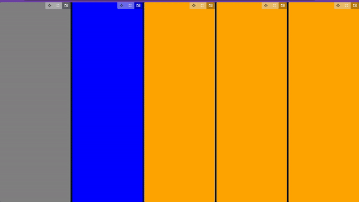

# React Smart-Layout

React Smart-Layout is a cutting-edge React library designed to effortlessly generate adaptive layouts that fit perfectly into any container. Empower your users by allowing them to swiftly reorganize elements and resize them to their needs.

## 🌟 Features:

- **State Preservation**: Maintains the state of components even after repositioning, ensuring a consistent user experience.
- **Persistent**: Layout: The layout remains intact even after page reload, offering users a reliable design continuity.
- **Adaptive**: Automatically adjusts content to fit any container size.
- **Animated**: Amazing animations for any element on the layout.
- **Movable**: Easy-to-use interface that lets users reposition elements in real-time.
- **Resizable Components**: Dynamically adjust the size of your components with intuitive resizing handles.
- **Highly Performant**: Optimized for peak performance to ensure smooth user interactions, even with a large number of components (don't be afraid to test it with grids and entire pages).
- **Seamless Integration**: Designed from the ground up to be easily integrated into any React project, no matter the size or complexity.

Give your users the ultimate layout experience and elevate your UI with React Smart-Layout! 🌐

## Example:

It's really easy to use you just need to import the `ComponentLayout`
and add your childrens

```typescript
import { ComponentLayout } from "smart-layout";

<ComponentLayout id="starting-layout">
  <div style={{ width: "100%", height: "100%", background: "gray" }} />
  <div style={{ width: "100%", height: "100%", background: "blue" }} />
  <div style={{ width: "100%", height: "100%", background: "orange" }} />
  <div style={{ width: "100%", height: "100%", background: "orange" }} />
  <div style={{ width: "100%", height: "100%", background: "orange" }} />
</ComponentLayout>;
```

### Result:



### ⚡ [PLAY WITH IT ON STACKBLITZ](https://stackblitz.com/edit/stackblitz-starters-wo6bmb?file=src%2FApp.tsx) ⚡

## 📅 Coming soon:

- [ ] Have custom styles
- [ ] Default layout
- [ ] Scroll on mobile
- [ ] Add callbacks to all buttons
- [ ] Find a way to return callbacks to manage the layout: e.g., startLayout()
- [ ] Dismount only the element that was hidden and preserve the layout order
- [ ] Minimize
- [ ] Resize
- [ ] Group layouts and move groups
- [ ] Alt tab to navigate between containers and open the selected one in full-screen.
